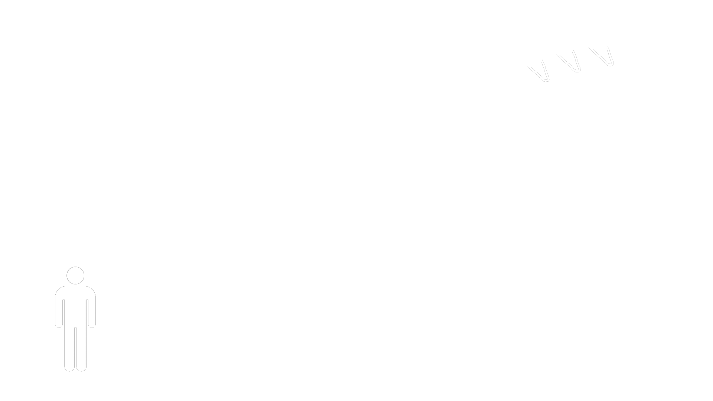
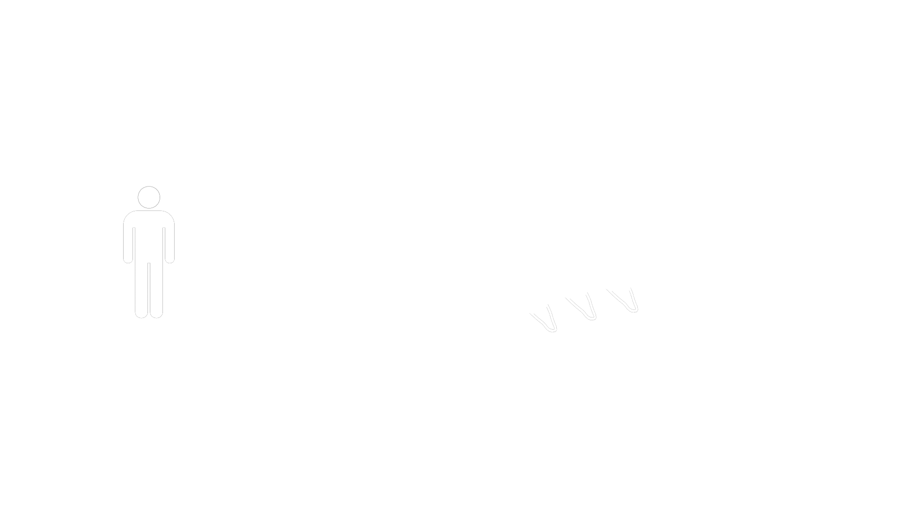
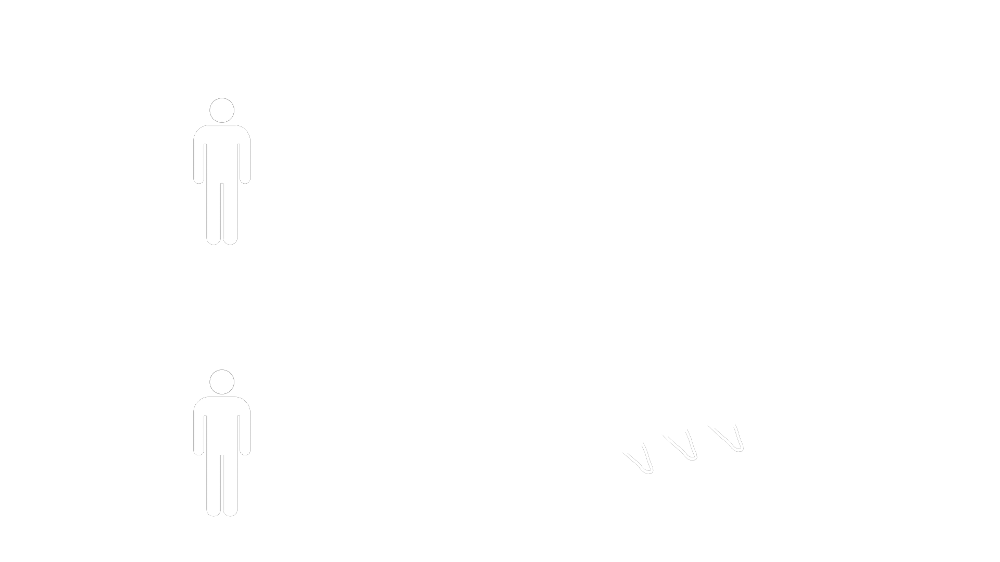
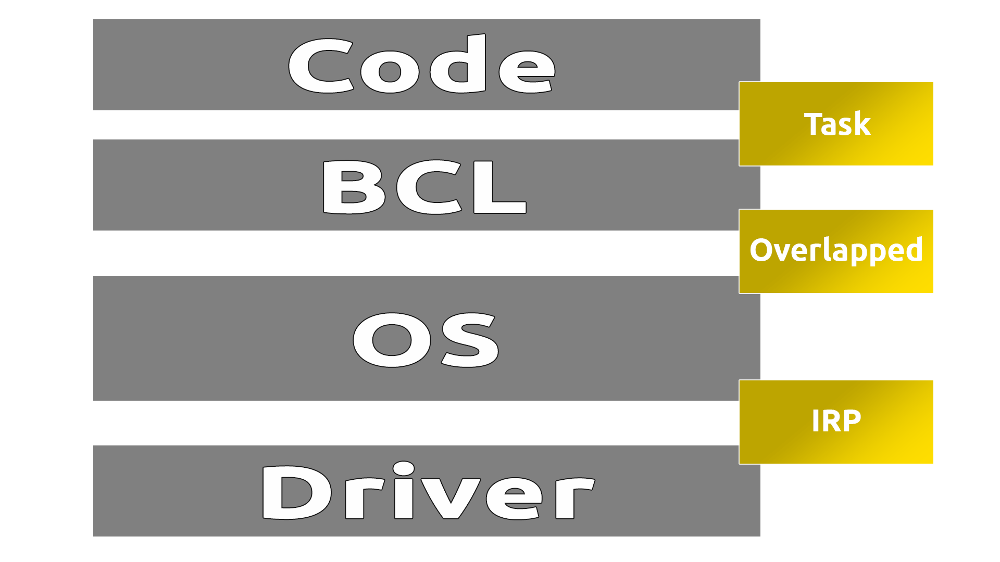
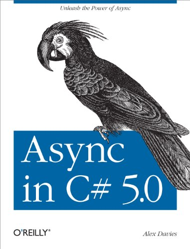
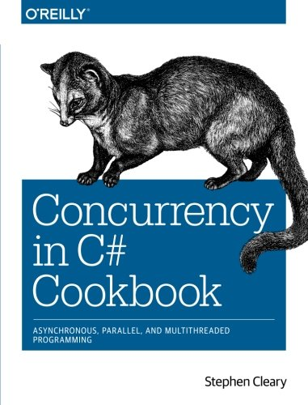

class: left, bottom
background-image: url(img/title.jpg)
background-size: cover

by **Maddin** 

<span style="position: absolute; bottom: 20px; right: 20px;">
**(Martin Pöpel)**
</span>

???

---
class: left, middle‚
background-image: url(img/background5.jpg)
background-size: cover

.left-column[
## Warum?
Warum dieser Vortrag?
]
???
---
class: left, middle‚
background-image: url(img/background5.jpg)
background-size: cover

.left-column[
## Warum?
Warum dieser Vortrag?
]

.right-column[

- Typische Fragen
  - Ab wann sind wir asynchron?
  - Wann startet ein neuer Thread?

]

---
class: left, middle‚
background-image: url(img/background5.jpg)

.left-column[
## Warum?
Warum dieser Vortrag?
]

.right-column[

- Typische Fragen
  - Ab wann sind wir asynchron?
  - Wann startet ein neuer Thread?
- Fehler durch Unwissenheit
  - Anwendung blockiert

]
???

---
class: center, top
background-image: url(img/background5.jpg)

<span style="font-size: 64pt">Synchron</span>  
  
<span style="font-size: 52pt">vs</span>  
  
<span style="font-size: 64pt">Asynchron</span>  
  
<span style="font-size: 52pt">vs</span>  
  
<span style="font-size: 64pt">Multithreaded</span>  

---
class: left, top
background-image: url(img/background5.jpg)

## Kollege A



???

---
class: left, top
background-image: url(img/background5.jpg)

## Kollege A

- synchron

```csharp
public void GoodMorning() {

  MakeCoffee();
  MakeBreakfast();
}
```

???

---
class: left, top
background-image: url(img/background5.jpg)

## Kollege B



???

---
class: left, top
background-image: url(img/background5.jpg)

## Kollege B

- asynchron

```csharp
public async Task GoodMorningAsync() {

  var coffeeTask = MakeCoffeeAsync();
  var breakfastTask = MakeBreakfastAsync();

  await Task.WhenAll(coffeeTask, breakfastTask);
}
```

???

---
class: left, top
background-image: url(img/background5.jpg)

## Kollege C & D



???

---
class: left, top
background-image: url(img/background5.jpg)

## Kollegen C & D

- multithreaded

```csharp
public void GoodMorning() {

  Thread coffeeThread = new Thread(new ThreadStart(MakeCoffee));
  Thread breakfastThread = new Thread(new ThreadStart(MakeBreakfast));

  coffeeThread.Start();
  breakfastThread.Start();
}
```

???
Wir sehen async ist nicht gleich Multithreading

---
class: left, middle
background-image: url(img/background5.jpg)

## Wann startet der Thread?
### Gibt es überhaupt einen?

???
Eventuell gibt es keinen Thread  
Mehr Infos dazu in einen Blog Beitrag von Stephen Cleary
---
class: center, top
background-image: url(img/background5.jpg)

## Wann startet der Thread?
  

*http://blog.stephencleary.com/2013/11/there-is-no-thread.html*

???
BCL = Base Class Library (Liegt über der CLR)
---
class: center, top
background-image: url(img/background5.jpg)

## Thread starten
Und wie startet man nun einen neuen Thread?

???

---
class: center, top
background-image: url(img/background5.jpg)

## Thread starten

```csharp
Task.Run();
```

???
Nutzt die TaskFactory  
Führt den Code auf einem anderen Thread aus  
Nutzt ThreadPooling

---
class: center, middle
background-image: url(img/background5.jpg)

## Was passiert im Hintergrund?

???
Dafür kann man IL Code dekompilieren
Bei mir stark vereinfachte Version

---
class: center, top
background-image: url(img/background5.jpg)

## Buchempfehlungen

<div style="display: table; clear: both; margin:0 auto;">
  <div style="float: left; width: 50%;">
    
  </div>
  <div style="float: left; width: 50%;">
    
  </div>
</div>
---
class: top, left
background-image: url(img/background5.jpg)

## Execution Context

async/await
- Speichert den Execution Context ab
- Und stellt ihn nach Verlassen der asynchronen Methode wieder her

???

- Sinnvoll für einen Render Thread
- sämtliche nebeläufigen Prozesse in .Net bauen auf den Execution Context auf
- für heute reicht es ihn mit dem Thread gleich zu setzen

---
class: top, left
background-image: url(img/background5.jpg)

## Execution Context

```csharp
async Task Start() 
{ 
  // Wir betreten die Methode in dem Ursprungs-Context

  var myResult = await DoSomethingAsync();

  // Wir verlassen die Methode in dem Ursprungs-Context
}

Task DoSomethingAsync() 
{
  // Hier sind wir auf einem anderen Context
}
```

???

---
class: center, middle
background-image: url(img/background5.jpg)

# Best Practices

---
class: top, left
background-image: url(img/background5.jpg)

## ConfigureAwait

```csharp
var myResult = DoSomethingAsync().Result; // Schlecht, weil blockiert!
```

???

- Was passiert wenn jemand die Methode so aufruft

---
class: top, left
background-image: url(img/background5.jpg)

## ConfigureAwait

```csharp
// Context wird wiederhergestellt
await DoSomethingAsync().ConfigureAwait(continueOnCapturedContext: true);
```

```csharp
// Context wird NICHT wiederhergestellt
await DoSomethingAsync().ConfigureAwait(continueOnCapturedContext: false);
```

---
class: top, left
background-image: url(img/background5.jpg)

## Async synchron aufrufen

```csharp
private void MyMethod()
{
  var awaiter = SomeLibrary.DoSomethingAsync().GetAwaiter();
  var myResult = awaiter.GetResult();
}
```

---
class: top, left
background-image: url(img/background5.jpg)

## void vermeiden

- async void bedeutet: Fire and Forget
- Exceptions werden nur mit dem await Schlüsselwort gefangen
- Anstatt **void** einen **Task** zurückgeben

---
class: top, left
background-image: url(img/background5.jpg)

## void vermeiden

- async void bedeutet: Fire and Forget
- Exceptions werden nur mit dem await Schlüsselwort gefangen
- Anstatt **void** einen **Task** zurückgeben

```csharp
public async Task DoSomethingAsync()
{
  ...
}
```

---
class: top, left
background-image: url(img/background5.jpg)

## void vermeiden

- Wenn sich void nicht vermeiden lässt (EventHandler, Command)
- Try-Catch-Block innerhalb der async void Methode verwenden

```csharp
public async void Button_Click()
{
  try 
  {
    ...
  }
  catch (Exception exception)
  {
    // Log Error
  }
}
```

---
class: left, top
background-image: url(img/background5.jpg)

## Links

- [**Stephen Cleary - The Blog**](https://blog.stephencleary.com/)

- [**Stephen Cleary - There Is No Thread**](https://blog.stephencleary.com/2013/11/there-is-no-thread.html)

- [**Async/Await - Best Practices in Asynchronous Programming**](https://msdn.microsoft.com/en-us/magazine/jj991977.aspx)

- [**Why you should use ConfigureAwait(false)**](https://medium.com/bynder-tech/c-why-you-should-use-configureawait-false-in-your-library-code-d7837dce3d7f)

- [**5Minds Blog**](https://blog.5minds.de/)

---
class: center, middle
background-image: url(img/title.jpg)
background-size: contain;
